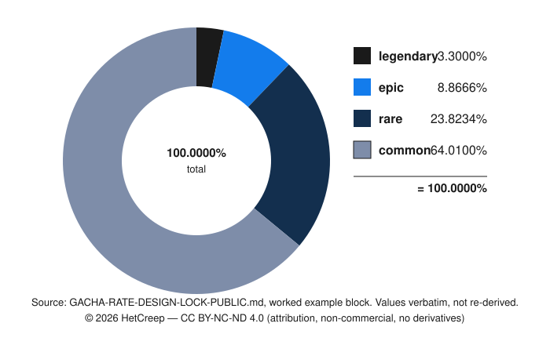

<!--
  © 2026 HetCreep — CC BY-NC-ND 4.0
  https://creativecommons.org/licenses/by-nc-nd/4.0/

  แชร์ต่อได้ ให้เครดิต ห้ามใช้เชิงพาณิชย์ ดัดแปลงไว้ใช้เองโดยไม่ใช่เชิงพาณิชย์ได้ แต่ห้ามเผยแพร่ฉบับดัดแปลง
  ใช้เชิงพาณิชย์หรือเผยแพร่ฉบับดัดแปลง ต้องขออนุญาตเป็นลายลักษณ์อักษรจากเจ้าของลิขสิทธิ์

  ฉบับนี้ถอดข้อมูลเฉพาะโปรเจกต์ออกแล้ว (ชื่อตัวละคร path ไฟล์ schema จริง สถานะ pool)
  เหลือเฉพาะวิธีการ สูตร งานวิจัย exemplar และตัวอย่างค่าที่ล็อกจริงหนึ่งชุด

  ⚠️ ไม่ใช่คำแนะนำทางกฎหมาย ตัวเลขทั้งหมดเป็นข้อเท็จจริงสาธารณะที่หาเองได้จากแหล่งที่อ้างไว้
-->

# วิธีตั้งเรต gacha โดยไม่ต้อง "เดาเลข"

`v1.2.1` · แก้ไขล่าสุด 2026-10-03 (ดู [changelog](#changelog) ท้ายเอกสาร)

**เอกสารนี้ตอบคำถามเดียว: เรต pity ราคา ควรเป็นเท่าไหร่ และคุณรู้ได้ยังไงว่าไม่ได้มั่ว**

คำตอบไม่ใช่ตัวเลข แต่เป็น **กฎ** ที่ทำให้ตัวเลขตกลงมาเอง — และเป็น **งานวัดจากเกมจริง 6 เกม**
ที่เผยแพร่เรตของตัวเองไว้ ไม่ใช่ "best practice" ลอย ๆ

> เขียนจากการทำ design lock ของเกมมือถือตัวหนึ่งที่พัฒนาในไทย ทุกค่าถูก ratify ทีละข้อกับ
> เจ้าของโปรเจกต์ พร้อมให้ดูที่มา ไม่ใช่แค่หัวข่าว ผ่าน adversarial review 3 มุมที่ทั้ง 3 ตัดสินว่า
> "พัง" แล้วพับ finding กลับเข้ากฎ

---

## ปัญหาที่เอกสารนี้แก้

เกือบทุกโปรเจกต์ตั้งเรตกาชาแบบนี้: มีคนเลือกเลขนึง (5%) ใส่ลง config แล้วเลขนั้นอยู่ตรงนั้นไปตลอด
ไม่มีใครรู้ว่าใครเลือก ไม่มีใครรู้ว่าทำไม และตอนโรสเตอร์โต ไม่มีใครรู้ว่าเลขควรขยับไหม

อาการที่ตามมาแบบคลาสสิก:

- **เลขที่โชว์ผู้เล่น กับเลขที่ server สุ่มจริง เป็นคนละแถว** — พิมพ์ซ้ำใน UI ครั้งนึง ใน docs ครั้งนึง
  แล้ววันหนึ่งอันใดอันหนึ่งเปลี่ยน อีกอันไม่เปลี่ยน
- **โรสเตอร์โตแล้วเรตต่อตัวเจือจางเงียบ ๆ** — band ยัง 5% เหมือนเดิม แต่ตัวละครหนึ่งตัวจาก 5% เป็น 0.3%
  โดยไม่มีใครตัดสินใจอะไรเลย
- **ผลรวมไม่เท่ากับ 100%** เพราะปัดเศษ แล้วแก้ด้วยการเขียน "ภายใน tolerance" ซึ่งพังตอน pool ใหญ่ขึ้น
- **ราคาถูกตั้งจากความรู้สึก** แล้วเทียบไม่ได้กับใครเลย

---

## 1. กฎ

> **ทุกตัวเลขในกาชาคือ BASE ที่เขียนด้วยมือครั้งเดียวต่อ banner type และ SCALE ที่เป็นเลขคณิตล้วน
> บนสมาชิกของ pool ระหว่างสองอย่างนี้ไม่มีอะไรถูกพิมพ์ด้วยมือ**

**BASE** (เขียนครั้งเดียว): ลำดับความหายาก `ord[r]` · ตาราง band rate `B[r]` ที่รวมได้ 1 พอดี ·
featured share `u` · weight ต่อ entry `w[i]` · ขนาด multi `K` · discount `d` · ราคา `c` ·
pity threshold `P[r]` · ช่วง reach ที่ยอมรับได้ `tau` · shard ต่อ duplicate `S[r]` · ladder `L[r][k]` ·
`rho` = ทศนิยมของ column ที่เก็บ rate

**ที่เหลือ DERIVE ทั้งหมด**: เรตของตัวละครหนึ่งตัว = band rate × within-band share

หัวใจอยู่ 4 บรรทัดนี้:

1. **`B` เป็นฟังก์ชันของ banner TYPE เท่านั้น** — ไม่อ่าน pool size ไม่อ่านจำนวนตัวละคร
   ไม่อ่านความคืบหน้าของ asset ⇒ **โรสเตอร์โตเปลี่ยนได้แค่ว่าใครอยู่ใน pool ไม่เคยเปลี่ยนเรต**
2. **ผลรวมเท่ากับ 1 พอดี ไม่ใช่ "ภายใน tolerance"** — สมาชิกตัวสุดท้ายของแต่ละแบนด์ดูดเศษปัดเข้าตัวเอง
3. **ตัวเลขที่ผู้เล่นเห็น = แถวเดียวกับที่ server สุ่ม** ทุกตัว ไม่มีเลขไหนถูกพิมพ์ซ้ำใน UI / docs /
   test / client config
4. **invariant ทุกข้อคือ assertion ที่ทำให้ build พัง** ไม่ใช่ให้ผู้เล่นเป็นคนเจอ

---

## 2. สูตร

```
-- ============ BASE (เขียนครั้งเดียว ไม่เคยต่อตัวละคร ไม่เคยต่อเคส) ============
ord[r]        rarity ordinal, หนึ่งชุดต่อเกม  (common < rare < epic < legendary)
B[type][r]    band rate ต่อ banner TYPE
u             featured share ของแบนด์ตัวเอง, 0 <= u < 1
w[i]          weight ต่อ entry, integer >= 1, default 1
K, d, c       multi size, discount, ราคาต่อครั้ง
P[r]          pity threshold (นับเป็น pull เต็มจำนวน); infinity = แบนด์นั้นไม่มี pity
tau_min, tau_max   ช่วง reach fraction ที่ยอมรับได้
S[r]          shard ต่อ duplicate ของ rarity r
L[r][k]       shard ที่ต้องใช้ถึงดาว k
rho           ทศนิยมของ rate column  (numeric(8,7) => rho = 7)

-- ============ SCALE (derive ทั้งหมด ไม่เคยพิมพ์) ============
pool_r  = { i : rarity(i) = r }              N_r = |pool_r|
feat_r  = { i in pool_r : featured(i) }      F_r = |feat_r|
W_r     = SUM(w[i] for i in pool_r)

share(i) = u * (featured(i) ? 1/F_r : 0) + (1 - u) * w[i] / W_r
           -- featured อยู่ในเศษที่เหลือด้วย ไม่ได้ถูกกันออก
           -- นิยามถูกต้องที่ N = 1, 2, 7, 50 โดยไม่มี special case

ideal(i) = B[rarity(i)] * share(i)

-- residual absorption: absorber = สมาชิกที่ id มากสุดในแบนด์ (deterministic)
rate(i)        = round(ideal(i), rho)                        ถ้า i ไม่ใช่ absorber
rate(absorber) = B[r] - SUM(rate(j) for j != absorber)
=> SUM(rate(i) ในแบนด์) = B[r] พอดี ทุก N_r >= 1
=> SUM(rate(i) ทั้ง pool) = SUM(B[r]) = 1 พอดี

cost(n) = c                        ถ้า n == 1
        = ceil(K * c * (1 - d))    ถ้า n == K

-- ============ PITY (derive) — มีได้หลายชั้น ============
levels = { r : P[r] < infinity และ B[r] > 0 และ N_r >= 1 }    -- ชั้นของ pity เรียงตาม ord จากสูงไปต่ำ
top    = ชั้นที่ ord สูงสุดใน levels                           -- เดิมชื่อ pity_rarity
q      = B[top]
c[r]   = counter ของชั้น r = จำนวน pull นับจาก drop ล่าสุดที่ ord >= ord[r]

ชั้นที่ยิง r* = ชั้นที่ ord สูงสุด ในบรรดาชั้นที่ c[r] + 1 >= P[r]   -- ต้องพลาดติดกัน P[r]-1 ครั้ง
                -- หลายชั้นถึงเพดานใน pull เดียวกัน ชั้นที่ ord สูงกว่าชนะ
pull ปกติ (ไม่มีชั้นไหนยิง)  rarity r ออกด้วย B[r]
pull ที่ชั้น r* ยิง           rarity ที่ ord > ord[r*] ยังออกด้วย B ของตัวเอง
                            r* ได้ 1 - SUM(B[r'] ที่ ord[r'] > ord[r*])
                            rarity ที่ ord < ord[r*] ได้ 0
                            -- floor pity ไม่แย่งโอกาสของแบนด์ที่สูงกว่า และไม่เปลี่ยน q บน pull ไหนเลย
forced draw = สุ่ม share(i) ภายในแบนด์ที่ออก    -- ไม่ใช่ order-by-id-limit-1
หลัง drop ของ r'  c[r] = 0 ทุกชั้นที่ ord[r] <= ord[r'], ชั้นอื่น +1
                  -- ได้ top แล้ว counter ทุกชั้นกลับเป็น 0

reach[top] = (1 - q)^(P[top] - 1)          -- สัดส่วน cycle ของ top ที่ไปถึงเพดานจริง
E[cycle]   = (1 - (1 - q)^P[top]) / q      -- pull เฉลี่ยต่อการได้ top 1 ครั้ง
reach[r]   = สัดส่วนรอบของชั้น r ที่ไปถึง pull ที่ชั้น r ยิง      สำหรับชั้นรอง
             -- รอบของชั้น r เริ่มใหม่ทุกครั้งที่ได้ drop ord >= ord[r] คำนวณจาก chain ข้างล่าง

-- ============ DELIVERED RATE (สิ่งที่ผู้เล่นได้จริง ไม่ใช่ base) ============
-- ได้ top แล้ว counter ทุกชั้นกลับเป็น 0 กระบวนการจึงเริ่มใหม่ทุก cycle ของ top (renewal)
D[top] = 1 / E[cycle]
D[r]   = E[จำนวน drop ของ r ใน 1 cycle] / E[cycle]     สำหรับ r != top
         -- E[...] คำนวณแบบ exact โดยไล่ chain ของสถานะ (c[top], c ของชั้นรอง) ภายใน 1 cycle
         -- ถ้าไม่มีชั้นรอง สูตรนี้ลดรูปเป็น D[r] = B[r] * (1 - D[top]) / (1 - q)
D_char(i)        = D[r] * share(i)                ถ้า i ไม่ใช่ absorber   (r = rarity(i))
D_char(absorber) = D[r] * rate(absorber) / B[r]   -- absorber รับเศษปัดของทั้งแบนด์ จึงใช้ rate ของแถวตัวเอง
-- D_char คือค่าที่พิมพ์ ไม่ใช่ค่าที่ sampler แจกจริง ระยะห่างต่อ pull มีขอบเขต
-- Df[r] = ส่วนของ D[r] ที่ออกด้วย forced draw (สุ่มตาม share)
-- ตัวที่ไม่ใช่ absorber   |D_char(i) - ที่แจกจริง| <= D[r] / B[r] * 0.5 * 10^-rho
-- absorber               |D_char - ที่แจกจริง|    <= Df[r] / B[r] * (N_r - 1) * 0.5 * 10^-rho   (Df[r] = 0 ตรงพอดี)
-- ผลรวม D_char ในแบนด์   |SUM - D[r]|           <= D[r] / B[r] * (N_r - 1) * 0.5 * 10^-rho
--                        ส่วนที่ sampler แจกจริงรวมกันได้ D[r] พอดี
=> SUM(D[r]) = 1

-- ============ SHARD / LADDER (derive) ============
shards_granted(i)    = is_new(i) ? 0 : S[rarity(i)]
pulls_to_terminal(i) = SUM(L[rarity(i)][k]) / (S[rarity(i)] * D_char(i))
```

**จุดที่คนพลาดบ่อยสุดคือ `D` กับ `B`** — `B` คือเรต base ที่ประกาศ แต่ผู้เล่นได้ `D` ซึ่งรวมผลของ pity
แล้ว ถ้าประกาศแค่ `B` โดยไม่พูดถึง `D` เลย ตัวเลขที่ประกาศจะต่ำกว่าความจริงเสมอ — และถ้า `P` เล็กมาก
มันจะต่ำกว่าแบบตลก ๆ (`P=1` ส่งของแบนด์บน 100% ขณะที่ประกาศ 5%)

---

## 3. INVARIANT — สิ่งที่ทำให้กฎนี้เป็นกฎ ไม่ใช่คำแนะนำ

แต่ละข้อคือ assertion ที่ทำให้ build พัง แต่ละข้อฆ่าบั๊กที่ระบุชื่อได้ ไม่ใช่บั๊กสมมติ
**ทุกข้อต้องรันเป็น automated test ใน CI ทุก commit ที่แตะ BASE value — checklist มือเป็นแค่ fallback ตอน CI ยังไม่ครอบคลุม**

| #        | invariant                                                              | ถ้าไม่มี จะพังยังไง                                                            |
| -------- | ---------------------------------------------------------------------- | -------------------------------------------------------------------------------- |
| **I1**   | `SUM(B[r]) == 1` พอดีที่ rho และ `0 < B[top] < 1`                     | —                                                                                |
| **I2**   | `SUM(rate(i)) == 1` **พอดี** ด้วย residual absorption ไม่ใช่ tolerance | tolerance ไม่ scale ตาม N — pool 20 ตัวพัง 74.3% ของเคส, pool 50 ตัวพัง 89.4%   |
| **I3**   | `B[r] > 0 => N_r >= 1`                                                 | pity ถูกบังคับให้เลือกจากแบนด์ที่ไม่มีสมาชิก แล้ว hard-error ถาวร               |
| **I3b**  | `B[r] = 0 => N_r = 0`                                                  | ตัวละครที่เรต 0% โผล่ใน list แต่สุ่มไม่ได้                                       |
| **I4**   | `0 < B[top] < 1` และ top คือ rarity ที่ ord สูงสุดที่ B > 0 | pool ที่ทุกตัวอยู่ในแบนด์ top → counter ค้างที่ 0 ตลอดกาล และถ้า rarity ที่สูงกว่า top ไม่มี pity → E[cycle] กับ D[top] นับ drop ของ rarity นั้นเป็นของ top |
| **I5b**  | `SUM(D[r]) == 1` และหน้าจอต้องแสดง delivered ไม่ใช่แค่ base            | `P=1` ส่งแบนด์บน 100% ขณะประกาศ 5%                                              |
| **I5c**  | % ต่อตัวที่แสดง == `round(100*rate(i), rho)` ทุกตัว                    | เรต featured ไม่มี assertion → pool โต 20 เท่าโดยเงียบสนิท                       |
| **I6**   | `publishable(banner) <=> invariant ทุกข้อผ่าน AND ทุกตัวผ่าน asset gate` | banner ที่ disclosure ผิดยัง publish ได้                                        |
| **I7**   | `w[i] >= 1` (integer)                                                  | `w = 0` → division by zero ทุก pull ทุกผู้เล่น; `w < 0` → เรตติดลบ               |
| **I8**   | แถวที่ผู้เล่น (role `anon`) เห็น == แถวที่ sampler อ่าน                | test รันเป็น superuser → พิสูจน์ odds ของ row set ที่ผู้เล่นอ่านไม่ได้           |
| **I9**   | `tau_min <= (1-q)^(P[top]-1) <= tau_max`                                    | `B[top]=0.30` → pity ยิงทุก 103,520 pull โดย invariant อื่นเขียวหมด             |
| **I10**  | `u > 0 => F_r >= 1` (ไม่มี fallback `u = 0`)                           | ถอด featured ออกเพราะ asset ไม่พร้อม → เรตตัวที่เหลือกระโดด 8 เท่า และยัง publish |
| **I11**  | `rate(i) >= 10^-rho` ทุกตัว                                            | แถวเรต 0 ผูก cumulative กับตัวก่อนหน้า → เกิด tie ใน `limit 1`                   |
| **I12**  | monotone rarity: เรตสูงสุดในแบนด์ที่หายากกว่า < เรตต่ำสุดในแบนด์ที่พบง่ายกว่า | legendary กลายเป็นตัวที่พบบ่อยที่สุดใน pool                                |
| **I13**  | monotone grind: `pulls_to_terminal(หายากกว่า) >= pulls_to_terminal(พบง่ายกว่า)` | `S` แยกตาม rarity แต่ `L` ไม่แยก → ตัวหายากที่สุดจบก่อน เกมสั้นลง 5.4 เท่า |
| **I14**  | ค่าคงที่ที่กระจายอยู่หลายที่ (`K`, `L`, `ord`, `rho`) ต้องตรงกับ base   | Postgres CHECK ใช้ subquery ไม่ได้ → literal ของ `K` 3 ชุดและ `L` 2 ชุดรอดกฎ    |
| **I15**  | ไม่มีแถว pity ของ (banner, rarity) ที่ไม่ใช่ชั้นใน levels ปัจจุบัน       | เปลี่ยน `B` แล้ว counter เก่าถูกตีความใหม่เงียบ ๆ                                |
| **I17**  | `cost_multi = ceil(K * c * (1 - d))` เสมอ พิมพ์แยกไม่ได้               | ราคา multi เข้ารหัสส่วนลดที่ไม่ได้ประกาศ                                        |
| **I18**  | `0.30 <= reach ของ floor pity <= 0.60`                                 | floor pity ที่ไม่มีใครไปถึง หรือยิงทุกครั้งจนไร้ความหมาย                        |
| **I19**  | เก็บ draw record ต่อผู้เล่นไม่ต่ำกว่า 90 วัน อ่านย้อนได้ต่อ pull        | ตลาดที่บังคับเก็บ log (เช่นจีน) ตรวจสอบข้อพิพาทเรื่อง odds ย้อนหลังไม่ได้        |

> เลข **I16** เว้นว่างโดยตั้งใจในฉบับสาธารณะนี้ — เป็น invariant เฉพาะโปรเจกต์ที่ถูกถอดออกพร้อมชื่อตัวละคร/path/schema
> จริงตามที่ระบุไว้ในหัวเอกสาร ไม่ใช่เลขพิมพ์ตก

**I2 คือข้อที่คนมองข้ามบ่อยสุด** — เขียน "ผลรวมอยู่ภายใน tolerance" มันดูสมเหตุสมผลตอน pool 5 ตัว
แต่ tolerance ไม่โตตาม N พอ pool ถึง 50 ตัว มันพังเกือบทุกเคส วิธีที่ถูกคือให้สมาชิกตัวสุดท้าย
**ดูดเศษ** เข้าตัวเอง แล้วผลรวมเท่ากับ 1 โดยโครงสร้าง ไม่ใช่โดยการหวัง

---

## 4. ที่มาจาก exemplar — เกมจริง 6 เกม พร้อมแหล่ง

นี่คือส่วนที่ทำให้เอกสารนี้ต่างจาก "best practice" ทุกบรรทัดในกฎข้างบนมาจากพฤติกรรมที่วัดได้ของ
เกมที่เผยแพร่เรตของตัวเองไว้ ไม่ใช่จากความเห็น


*รูป — สรุปภาพรวมของตารางด้านล่าง ตัวเลขและแหล่งอ้างอิงจริงอยู่ในรายการ prose ต่อจากนี้ ถ้ารูปกับ
เนื้อหาขัดกัน ให้ยึดเนื้อหา*

### band rate เป็นค่าคงที่ ฟังก์ชันของ banner type เท่านั้น

- **Genshin** 0.600% นิ่งตอน roster โตจาก 5 → 8 ตัว
- **Honkai Star Rail** 0.600% / 1.600% / pity 90 เหมือนกันทุกหลักตั้งแต่ v1.5 (2023-11) ถึง v4.4
  (2026-08) ขณะที่ roster โตจาก ~9 → 70+
- **Arknights** 2% ตั้งแต่ภาพ disclosure วันเปิดตัวถึงโพสต์ EN 2026-04-28
- **FGO** 1% ต่อเนื่องสิบเอ็ดปี
- **Fire Emblem Heroes** 3%/3% ที่ 90 ตัว และ 3.00%/3.00% ที่ ~1,528 ตัว

**อ่านตรงนี้ให้ดี**: ห้าเกม ห้าสตูดิโอ ทุกเกมโรสเตอร์โตหลายเท่า **ไม่มีเกมไหนขยับ band rate เลย**
สิ่งที่ขยับคือ *ใครอยู่ใน pool*

### โรสเตอร์โต = pool membership ขยับ ไม่ใช่เรต

- **Arknights** ถอด 6★ 21 ตัวและ 5★ 37 ตัวออกจาก pool (2023-03-30) แทนที่จะขึ้นจาก 2%
- **HSR** แช่ permanent 5★ pool ไว้ที่ 7 ตัวเดิมสามปี และตรึง event pool ที่ N=8
- **Blue Archive** กัน Fest/Recollection/Archive ออกจาก 108 ตัว
- **FGO** curate pool ต่อ banner (18 non-pickup 5★ ทั้งที่มี 65)
- **FEH** ปลด hero จากแบนด์ 5★ ลง 4★

### เรตต่อตัวเป็นเลขคณิตที่ generate ไม่ใช่คนเขียน

- **Blue Archive**: featured 0.700000%, อีก 107 ตัวเท่ากันหมดที่ 0.021495% = (3.0−0.7)/107
  และ Nexon ประกาศทิศทางการ derive เอง — 「세부 확률은 소수점 7번째 자리에서 반올림한 수치이며,
  실제 합산 확률은 100%에 맞추어 적용됩니다」 (ปัดที่ทศนิยมที่ 7 แล้วบังคับผลรวมเป็น 100% พอดี)
- **FGO**: (1.000−0.700)/18 = 0.016
- **FEH**: ประกาศตรง ๆ ว่า "Heroes do not have individual drop rates"

### ผลรวมบังคับเป็น 1 พอดี + ประกาศกฎการปัดข้างตาราง

Blue Archive ทำ residual absorption ตรง ๆ ส่วน **FGO ประกาศตรงข้าม** —
「確率は小数第4位で切り捨てているため，合計値が100％にならないこともある」 (ตัดที่ทศนิยมที่ 4
ผลรวมจึงอาจไม่เท่ากับ 100%) สองทางนี้ต่างกันจริง เลือกทางไหนก็ได้ แต่ต้อง**ประกาศว่าเลือกทางไหน**

### pity เป็น counter นอก sampler บอกเป็นจำนวน pull เต็ม

Blue Archive เพดาน 2 ขั้น 100/200 point (100 = การันตี ★3, pickup 50% · 200 = การันตี pickup;
recruitment-charge มี 2 ชนิด (ปกติ กับ 限定) นับแยกกัน ไม่ใช้ร่วมกัน รีเซ็ตเมื่อได้ตัวเป้าหมายของแบน pickup ที่ใช้
charge ชนิดเดียวกันเท่านั้น (ตัว pickup ของแบนอื่นที่ได้ระหว่างสุ่มอีกแบน ไม่ทำให้รีเซ็ต) 「同種類の任意のピックアップ募集でピックアップ対象をお迎えした時のみ」 —
แบนจบไม่รีเซ็ต charge ยกไปแบนถัดไป 「それまでの「呼び出しチャージ」は引き継がれます」 —
เปลี่ยนจากระบบ gacha-point เดิม 2026-07-29, ประกาศที่ bluearchive.jp/news/newsJump/679) ·
FGO 330 step function แบน 1–329 · Arknights spark 300 contract แบบ deterministic · FEH 40-summon
free choice

### floor pity ของแบนด์รอง — มีทุกเกมที่มี 3 แบนด์ขึ้นไป

Genshin และ HSR รัน counter 90 pull ของแบนด์บน **และ** floor 10 pull ของแบนด์รอง ·
Blue Archive สลับตารางบน slot ที่ 10 · Arknights การันตี 5★ ใน 10 pull แรก

### multi-pull เป็น batch ของ UI ไม่มีเนื้อหาเชิงเศรษฐกิจ (`d = 0`)

Genshin 10-pull = 10 Fates เป๊ะ · HSR เรียกมันเองว่า "a pure UI convenience" ·
Arknights 6000 Orundum = 10 × 600 · Blue Archive 1200 Pyroxene = 10 × 120

**ไม่มีเกมไหนลดราคาหัวข่าวสำหรับ multi** FGO แถมใบที่ 11 และ FEH รัน ladder 5/4/4/4/3 (ซึ่งเป็นคนละ
เรื่องกับส่วนลด) ⇒ default ที่ถูกคือ `d = 0` ถ้าราคา multi ของคุณไม่เท่ากับ `K × c` เป๊ะ แปลว่าคุณมี
ส่วนลดซ่อนอยู่ที่ยังไม่ได้ประกาศ

### duplicate keyed ตาม rarity และ source-agnostic

Genshin เขียนคำต่อคำว่า "whether obtained in a wish, redeemed at the shop, or awarded by the game" ·
HSR ใช้ถ้อยคำเดียวกัน · ระดับตาม rarity: Blue Archive 30/5/1, FGO 90/50/30, Arknights 10/5→15/8

**ไม่มี exemplar ไหนให้ shard เท่ากันข้าม rarity**

### ประกาศทั้ง base และ delivered

Genshin พิมพ์คู่ 0.600% base / 1.600% consolidated ทุก banner · HSR เหมือนกัน

### ประกาศเรตต่อตัวละคร ไม่ใช่แค่ band %

Blue Archive 0.021495% ต่อคน (ตามกฎหมายเกาหลี) · FGO 0.016% ต่อใบ ตั้งแต่ 2018-04-04
(เพราะ Apple App Store Review Guidelines 2017) · FEH เปิด "Details" ให้ผู้เล่นนับเอง

### display ต้อง generate จากตารางที่ sampler อ่าน — ทุก exemplar เป็น *คำเตือน* ไม่ใช่แบบอย่าง

- **Genshin EN** ทำคำว่า "promotional" หล่นจนพิมพ์ประโยคผิดบนหน้าที่ผูกกับกฎหมาย
- **Blue Archive** tutorial รันเรต 2.5% ค้างอยู่ **สิบสองเดือน** หลังยกทั้งเกมเป็น 3% ต้อง patch แยก
- **Arknights** เผยแพร่ disclosure เป็น PNG ที่ทำด้วยมือ
- **FGO** เป็นเคสบวกเคสเดียว — เศษที่พิมพ์เปลี่ยนตาม pool size แบบเลขคณิต ซึ่งเป็นพฤติกรรมของ generator

**สี่ในห้าเกมใหญ่เคยพลาดเรื่องเดียวกัน: เลขที่โชว์กับเลขที่สุ่มไม่ใช่แถวเดียวกัน**

### แหล่งอ้างอิงหลัก (สาธารณะทั้งหมด)

```
Genshin        gs.hoyoverse.com/static/hk4e-official-gacha-probability-fe/index.html?lang=en-us
               webstatic.mihoyo.com/hk4e/gacha_info/... (JSON ต่อ banner)
HSR            operation-webstatic.hoyoverse.com/gacha_info/hkrpg/... (JSON ต่อ banner)
Arknights      ak.hypergryph.com/news/6273 · ak.hypergryph.com/news/2023033352.html
               web.hycdn.cn/arknights/official/upload/images/20190501/... (PNG disclosure)
Blue Archive   forum.nexon.com/bluearchive/board_view?board=4606&thread=2480089 · m.nexon.com/probability/7717
               bluearchive.jp/news/newsJump/229 · /344 · /624 · /680 (ประกาศ 7/29) · /679 (เลขกลไกจริง)
FGO            4gamer.net/games/266/G026651/20180404124/
               news.fate-go.jp/info/servant_coin/
               nlab.itmedia.co.jp/nl/articles/1804/04/news130.html
FEH            new-guide.fire-emblem-heroes.com/en-US/feh-2020.html · /feh-3020.html
               feheroes.fandom.com/wiki/Summon
```

### compliance checklist ต่อ jurisdiction — invariant ข้อไหนตอบกฎ/policy ข้อไหน

revalidate ทุก 30 วัน หรือทันทีที่มี amendment ใหม่ประกาศ (regulatory surface เปลี่ยนเร็ว)

| กฎ/policy | มีผลตั้งแต่ | ข้อบังคับหลัก | invariant ที่ตอบโจทย์ |
| --- | --- | --- | --- |
| Korea Game Industry Promotion Act | 2024-03-22 | แสดง probability บนหน้าซื้อในเกมจริง ถ้าไม่เปิดเผยหรือแสดง probability เท็จ รัฐมนตรีอาจออกคำสั่งแก้ไขตาม [Article 38(9)](https://www.law.go.kr/법령/게임산업진흥에관한법률/제38조) และเฉพาะผู้ไม่ปฏิบัติตามคำสั่งนั้นจึงมีโทษตาม [Article 45](https://www.law.go.kr/법령/게임산업진흥에관한법률/제45조) จำคุกไม่เกิน 2 ปี หรือปรับไม่เกิน ₩20M | I5c, I8 |
| China Ministry of Culture Notice | 2017-05-01 | เผยแพร่ probability + เก็บ draw log ≥90 วัน | I5c, **I19** |
| Apple App Store Guideline 3.1.1 | 2017-12 | disclose odds ก่อนผู้เล่นกดซื้อ ไม่ใช่แค่มีตารางอยู่ที่ไหนสักที่ | I8 |
| Google Play Developer Policy (loot box) | 2019-05 | เงื่อนไขเดียวกับ Apple | I8 |

หมายเหตุ (2026-09): ร่างแก้ไขเพิ่มเติมของ ส.ส. Kim Sung-hoe (เสนอ 2025-12-23, เพิ่มโทษปรับสูงสุด 3%
ของยอดขาย/₩1B) ยังอยู่ระหว่างพิจารณาชั้นกรรมาธิการ (ทบทวนถึง ก.พ. 2026, กระทรวงผู้รับผิดชอบยังมีท่าที
ระมัดระวัง) — **ยังไม่บังคับใช้** แยกจากการแก้ไขที่มีผลบังคับแล้วข้างต้น

---

## 5. ราคา — วิธีที่ผิด 2 รอบก่อนจะถูก

ส่วนนี้น่าจะมีประโยชน์ที่สุดสำหรับคนทำเกมไทย เพราะ **วิธีที่ดูสมเหตุสมผลที่สุดผิดทั้งสองรอบ**

### รอบที่ 1 (ผิด) — สมมติว่าทุกเกมขายราคา USD เท่ากันทั่วโลก

เอาราคา USD ของแต่ละเกมมาหารด้วยค่าแรงไทย แล้วสรุปว่าแพงหรือถูก

**ผิดตรงไหน**: เกมกาชาสายใหญ่ทำ **regional pricing** จริง — SEA ตั้งราคาต่ำกว่า USD nominal
ประมาณ 50-70% การเอาราคา USD มาเทียบตรง ๆ จึงเปรียบเทียบของคนละอย่าง

### รอบที่ 2 (ยังผิด) — ใช้ค่าแรง**ขั้นต่ำ**เป็นตัวหารทุกประเทศ

พอแก้เป็นราคาท้องถิ่นจริงแล้ว หารด้วยค่าแรงขั้นต่ำของแต่ละประเทศ ผลออกมาว่าจีนแพงผิดปกติ
(burden 12.70-15.88% เทียบกับ JP/KR/US ที่ 1.84-5.69%)

**ผิดตรงไหน**: ค่าแรงขั้นต่ำของจีนอยู่แค่ **18-26% ของค่าแรงเฉลี่ย** ขณะที่ไทยอยู่ **47-66%**
และค่าเฉลี่ย OECD อยู่ที่ ~55% (อัตราส่วนนี้เรียกว่า Kaitz ratio)

พูดอีกอย่าง: **"ค่าแรงขั้นต่ำ" ไม่ได้แปลว่าสัดส่วนเดียวกันของรายได้จริงในสองประเทศ** — ใช้เป็นตัวหาร
ข้ามประเทศไม่ได้

### รอบที่ 3 (ถูก) — ราคาท้องถิ่น ÷ ค่าแรง**เฉลี่ย** ของประเทศตัวเอง ไม่ผ่าน FX เลย

วัด 9 จุดจากเกมจริง แต่ละจุดใช้ราคาในสกุลเงินของประเทศนั้น หารด้วยค่าแรงเฉลี่ยของประเทศนั้น
ไม่มีการแปลงค่าเงินอยู่ในสมการเลยสักครั้ง:

```
เกาหลี — Blue Archive (เฉลี่ย)       0.94%
ญี่ปุ่น — FGO คุ้มสุด                0.98%
สหรัฐฯ — Genshin                     1.00%
สหรัฐฯ/ญี่ปุ่น — FEH คุ้มสุด          1.08%
เกาหลี — Blue Archive (median)       1.15%
สหรัฐฯ/ญี่ปุ่น — FEH เล็กสุด          1.32%
ญี่ปุ่น — FGO เล็กสุด                1.48%
จีน — Genshin/HSR                    3.36%
จีน — Arknights                      4.20%

ค่าเฉลี่ย 1.72%  ·  มัธยฐาน 1.15%  ·  ช่วง 0.94-4.20%
```

พอแก้ตัวหารเป็นค่าแรงเฉลี่ย **จีนเข้ากลุ่มเดียวกับทุกคนทันที** (3.36-4.20% ไม่ใช่ 12-16%)

**ใช้มัธยฐาน ไม่ใช่ค่าเฉลี่ย** เพราะทนต่อ outlier ฝั่งจีนมากกว่า

**สูตรสำหรับตลาดไทย** (ตัวเลขค่าแรงเป็นข้อมูลสาธารณะ เปลี่ยนตามปี ควรอัปเดตเอง):

```
ค่าแรงเฉลี่ยทั้งประเทศ ฿15,700/เดือน ÷ 21.75 วันทำงาน = ฿721.84/วัน

ราคาต่อ pull = 1.15% × ฿721.84 = ฿8.30
```

**ข้อควรระวังที่ต้องบอกไว้**: ราคา pull ของ FGO/FEH/Blue Archive ที่ใช้เป็นค่าประมาณจากช่วงราคา
ไม่ใช่ตัวเลขนิ่งจาก official store ทุกจุด — มัธยฐานทนต่อความคลาดเคลื่อนของจุดเดียวได้ แต่ไม่ใช่
ตัวเลขที่ verify 100%

**revalidate cadence**: ตัวเลขค่าแรงเฉลี่ยข้างบนต้องเช็คใหม่ทุกต้นปี (ไม่ใช่แค่ "ควรอัปเดตเอง" ลอย ๆ) —
เช็คพร้อมกับรอบ compliance checklist ใน §4 ได้เลย

---

## 6. ตัวอย่างค่าที่ล็อกจริงหนึ่งชุด

> **นี่คือคำตอบของโปรเจกต์หนึ่ง ไม่ใช่คำตอบสากล** — เอาไปดูวิธีคิด อย่าลอกตัวเลข
> เกมคุณมีโรสเตอร์ ตลาด และโมเดลรายได้คนละแบบ input ต่างกันผลก็ต่างกัน

**band rate — เลือกจุดกึ่งกลางของ corridor ที่วัดได้**

ช่วง exemplar: 0.600% (Genshin/HSR) → 6% (FEH) ⇒ จุดกึ่งกลาง `(0.6 + 6) / 2 = 3.3%`

```
legendary   0.0330000    3.3000 %
epic        0.0886663    8.8666 %
rare        0.2382337   23.8234 %
common      0.6401000   64.0100 %   <- absorber ดูดเศษปัดให้ SUM = 1 พอดี
```

<figure>
  <picture>
    <source srcset="assets/g2-band-rate-distribution-dark.svg" media="(prefers-color-scheme: dark)" />
    
  </picture>
  <figcaption>รูป — คำนวณจากตารางด้านบน (<code>legendary 0.0330000 · epic 0.0886663 · rare 0.2382337 · common 0.6401000</code>) ถ้ารูปกับตัวเลขในตารางขัดกัน ให้ยึดตาราง</figcaption>
</figure>

*ค่าทั้งหมดในรูปนี้มาจากตารางสี่บรรทัดข้างต้นโดยตรง ไม่มีการคำนวณเพิ่มเติมในรูป*

แบ่งแบนด์ล่างแบบ geometric อัตราส่วน `r = 2.686857` ตกลงมาจากสมการ ไม่ได้เลือกเอง

**4 แบนด์ ไม่ใช่ 3** — เพราะโรสเตอร์นี้ตัวหายากยัง "เล่นได้จริง" ไม่ใช่ filler แบบ 3★ weapon
ของ Genshin จึงไม่มี "dump tier" ที่โครงสร้าง 3 แบนด์ทุกตัวพึ่งอยู่ (รูปนี้ตาม Arknights)

**pity**

```
P[legendary] = 100      reach = 3.61%    E[cycle] = 29.25 pull
P[epic]      = 10       reach = 30.72%   (floor pity, ตาม I18: 0.30 <= reach <= 0.60)
```

delivered rate เมื่อมี pity ทั้งสองชั้น (คำนวณแบบ exact จาก chain ของสถานะ ตรวจซ้ำด้วยการจำลอง)

```
              base B      delivered D
legendary     3.3000 %     3.4193 %
epic          8.8666 %    13.3910 %
rare         23.8234 %    22.5638 %
common       64.0100 %    60.6258 %
```

floor pity ของ epic ยก epic จาก 8.8666% เป็น 13.3910% โดยไม่เปลี่ยนเรต legendary เลย และ reach ของ
epic 30.72% อยู่ในกรอบ I18 ส่วนฉบับก่อน v1.2.0 พิมพ์ reach นี้เป็น 43.36% ซึ่งคิดราวกับว่ามีแต่ epic ที่ reset
counter ของ epic แต่ legendary ก็ reset ด้วย

`P = 100` ถูกเลือกเหนือค่าที่ derive ได้ (`P = 80`) เพราะ reach ที่ 100 ต่ำกว่าที่ทุก exemplar
พึ่ง pity อยู่ — คือ **ผู้เล่นส่วนใหญ่ได้ของก่อนถึงเพดาน** ซึ่งเป็นเจตนาของ flat rate

**ราคา** (ต่อจาก §5 — สมมติ 1 gem = ฿0.5)

```
c = ฿8.30 ÷ ฿0.5/gem = 16.60  ->  17 gem   (ปัดเป็นจำนวนเต็มที่ใกล้ที่สุด)
cost_multi = ceil(10 × 17 × (1 - 0)) = 170 gem = ฿85.00     [I17, d = 0]
```

**shard ต่อ duplicate — FROZEN โดยตั้งใจ ไม่ derive**

```
common 1  ·  rare 3  ·  epic 7  ·  legendary 19
```

ตอนแรก derive จากอัตราส่วน `r` ตัวเดียวกับที่แบ่งแบนด์ ซึ่งดู "สวย" — แต่แปลว่า **ทุกครั้งที่
re-ratify band rate ในอนาคต เศรษฐกิจ shard ทั้งระบบจะถูก reprice เงียบ ๆ** ทั้งที่เป็นคนละการตัดสินใจ

วัด wobble จริงในช่วง corridor: ค่า `S[legendary]` แกว่งจาก 9.19 ถึง 134.32 (14 เท่า)

เช็ค exemplar: Blue Archive 30/5/1, FGO 90/50/30, Arknights 10/5→15/8 — **ทั้งสามเป็นตารางแบน
ที่คนเขียนเอง ไม่มีเกมไหน derive จากสูตร** ⇒ ตัด tie ทิ้ง freeze เป็น base อิสระ

**บทเรียน: "derive ได้" ไม่ได้แปลว่า "ควร derive" — ผูกสองระบบที่เป็นคนละการตัดสินใจเข้าด้วยกัน
คือหนี้ ไม่ใช่ความสง่างาม**

**star ladder — uniform 6 duplicate ทุก rarity (★2→★5)**

ดราฟต์แรกใช้ ladder แยกตาม rarity (legendary/epic ★3→★5 ที่ 100/60 shard ต่อขั้น) แล้วคำนวณออกมาว่า
**maxed legendary = 909 pull** ซึ่งแพงกว่า FGO NP5 (เกมที่กิน duplicate หนักที่สุดในกลุ่ม) ถึง 3 เท่า

เทียบ exemplar จริง:

```
Genshin C6        ~7 copies    350-540 pull
FGO NP5           ~5 copies    500-567 pull
Arknights Pot6     0 copies    (duplicate เป็น side-grade ไม่ใช่แกนพลัง)
```

รื้อใหม่ด้วย `dup = 6` เท่ากันทุก rarity — เลือก 6 เพราะเป็นค่าเดียวที่หารลงตัวพร้อมกันกับ `S` ทั้ง 4 ค่า
ที่ freeze ไว้ (ข้อจำกัดทางคณิตศาสตร์จริงจาก `gcd(3, S)`) ผลลัพธ์:

```
legendary   364 pull    <- อยู่ในช่วง Genshin C6 และต่ำกว่า FGO NP5
epic        203 pull
rare         50 pull
```

**featured share `u = 0` ถาวร**

ไม่ใช่ "ยังไม่ทำ" แต่คือ **จะไม่ทำ** — ไม่มีกลไก featured character ในเกมนี้เลย

เหตุผลไม่ได้มาจาก exemplar (ทุกเกมมี featured) แต่มาจากงานวิจัยเรื่องพฤติกรรม: featured banner ทำงาน
ผ่าน **targeted desire** — ผู้เล่นเล็งตัวใดตัวหนึ่ง แล้วกลไก variable-ratio reinforcement (Skinner),
near-miss effect, goal-gradient effect ทำงานแรงขึ้นมากเมื่อมีเป้าหมายเฉพาะเจาะจง เอาเป้านั้นออก
แรงกดดันก็หายไปด้วย เป็นการตัดสินใจเชิงจริยธรรมของเจ้าของโปรเจกต์ ไม่ใช่ข้อสรุปทางเทคนิค

---

## 7. DEPARTURE — จุดที่ไม่มี exemplar รองรับ พร้อมเหตุผล

ส่วนนี้สำคัญพอ ๆ กับส่วนที่มี exemplar รองรับ **เพราะการบอกว่า "ตรงนี้ไม่มีใครทำแบบเรา" คือสิ่งที่แยก
งานวิจัยออกจากการอ้างอิงแบบเลือกข้าง**

1. **ไม่มี soft-pity ramp** — Genshin/HSR/Arknights รัน ramp ทั้งหมด ที่นี่ ship flat + hard step
   ขั้นเดียว (รูปของ FGO และ Blue Archive) **เหตุผล**: ramp เพิ่มตัวเลขที่ผู้เล่นตรวจสอบเองไม่ได้
   และทดสอบไม่ไหวที่ sample 1,000 pull
2. **featured slot มีโครงสร้างรองรับแต่ว่างถาวร** — และ **ไม่มี fallback `u = 0` อัตโนมัติ** (I10)
   fallback แบบนั้นแปลง "ของหาย" ที่มองเห็น เป็น "จัดสรรใหม่" ที่มองไม่เห็น
3. **banner type เดียว ไม่ใช่ห้า** — สตูดิโอใหญ่ได้สิทธิ์ทำหลาย type หลังสะสม content หลายปี
   ทำตั้งแต่โรสเตอร์เล็กคือ over-build
4. **ไม่มีสกุลเงินชั้นที่สอง** — exemplar ทุกเกมใช้สองโทเคน ที่นี่คิดตรง ๆ สกุลเดียว สองขั้นมีไว้
   บังราคาต่อ pull ซึ่งที่ scale นี้ไม่ได้ซื้ออะไร และเพิ่มที่ให้ราคา drift เป็นสองเท่า
5. **แบนด์พื้นเป็นตัวละคร ไม่ใช่อุปกรณ์** — FGO ระบุเองว่าไอเดียที่ถ่ายทอดได้ที่สุดคือการผลิตปริมาณ
   pull ด้วย content ที่ไม่ใช่ตัวละคร (56% ของทุก pull เป็น Craft Essence) โปรเจกต์ที่ไม่มี equipment
   ต้องให้แบนด์ล่างทำงานนั้นด้วยตัวละครจริง ซึ่งใจกว้างกว่าทุก exemplar **และเป็นหนี้ที่เคส pool
   50 ตัวจะมาทวง**
6. **pity target derive ไม่ใช่ประกาศ** — ไม่มี exemplar ไหนคำนวณ ทั้งห้าประกาศตรง ๆ ที่นี่ derive
   เพราะค่าที่ประกาศ **วัดได้ว่าขัดกับ pool ได้จริง** (ทดสอบทั้งสองเคสบน PGlite):
   pool ที่ไม่มีสมาชิกที่ pity rarity → สำเร็จ 29 pull แล้ว hard-error ตลอดกาล ·
   pool ที่ทุกตัวเป็น pity rarity → counter ค้างที่ 0
   **แต่**: การ derive ต้องมี `ord[r]` ที่เขียนด้วยมือ ซึ่งเป็น base ใหม่ — ประกาศไว้ตรง ๆ ดีกว่าแกล้ง
   ว่ามัน derive ได้
7. **residual absorption** — Blue Archive รองรับแนวคิด แต่ไม่มีเกมไหนประกาศว่า *ใคร* เป็นตัวดูดเศษ
   **ผลข้างเคียงที่ต้องระบุ**: สมาชิกตัวสุดท้ายต่างจากพี่น้องได้สูงสุด `(N_r−1)/2` ULP —
   ที่ `N_r = 50, rho = 7` คือ ~2.5e-6 absolute (~0.018% relative) เล็กแต่ไม่ใช่ศูนย์
8. **I12 / I13 (monotone rarity และ monotone grind)** — ไม่มี exemplar ไหนประกาศ เพราะโรสเตอร์ของเขา
   ใหญ่พอที่แบนด์จะไม่กลับหัวโดยบังเอิญ โรสเตอร์เล็กพลิกได้จริง

---

## 8. สิ่งที่กฎนี้ไม่ตัดสิน

กฎบังคับ**รูป** ไม่ได้บังคับ**ระดับ** — ระดับของ `B`, `P`, `c`, `d`, `S`, `L`, `u`, `tau`
เป็นการตัดสินใจของเจ้าของโปรเจกต์ทั้งหมด และกฎผลิตบันทึกการตัดสินใจนั้นให้ไม่ได้

**สองข้อที่ควรรู้ว่าเป็น limit ที่รับไว้ ไม่ใช่ช่องที่ลืม**:

- **terminal state** — ผู้เล่นที่เก็บครบชนกำแพงแล้ว banner คืนอะไรไม่ได้เลย ทุก exemplar มี sink:
  HSR Companion Spirit, Genshin Masterless Starglitter/Stella Fortuna, FGO Servant Coins,
  Arknights Distinction Certificates, FEH merge/skill-inheritance/feathers
  **นี่เป็นโดเมน reward ไม่ใช่โดเมน rate — ต้องเปิดเรื่องแยก**
- **ค่าคงที่ของ statistical test** (`PULLS`, `TOLERANCE_SIGMA`, `PITY_RUNS`) ไม่ใช่ค่าเศรษฐกิจ
  เลือกด้วยมือโดยตั้งใจ และควรอยู่แบบนั้น

---

## 9. วิธีเช็คว่ากฎถูกใช้จริง ไม่ใช่แค่เขียนไว้

1. **เปลี่ยน `B` หนึ่งค่า** แล้วดูว่าเรตต่อตัวทุกตัว, delivered rate, ตัวเลขบนหน้าจอ และ pity
   denominator ขยับตามทั้งหมดโดยไม่ต้องแก้อะไรอีกเลย ถ้ามีที่ไหนต้องแก้ตาม แปลว่าที่นั่นมีเลขพิมพ์ซ้ำ
2. **เพิ่มตัวละครหนึ่งตัวเข้า pool** แล้วดูว่า `SUM = 1` ยังพอดี และ band rate ไม่ขยับ
3. **ตั้ง `P = 1`** แล้วดูว่า build พัง (I9/I5b) ถ้าไม่พัง แปลว่า invariant เป็นแค่คอมเมนต์
4. **ตั้ง `w = 0`** ให้ตัวใดตัวหนึ่ง แล้วดูว่า build พัง (I7) ไม่ใช่ให้ผู้เล่นเจอ division by zero
5. **รัน test เป็น role ของผู้เล่นจริง ไม่ใช่ superuser** (I8) — ไม่งั้นคุณพิสูจน์ odds ของ row set
   ที่ผู้เล่นอ่านไม่ได้
6. **grep หาเลขเรตในโค้ด client, ใน docs, ใน test** ถ้าเจอที่ไหนนอกจากตารางเดียว นั่นคือแหล่งที่สอง
   ที่รอ drift

---

## สรุปสั้น

- **อย่าเลือกเลข เลือกกฎ** แล้วให้เลขตกลงมา
- **band rate ห้ามเป็นฟังก์ชันของขนาด pool** — 5 เกมใหญ่ยืนยันด้วยการไม่ขยับเลยตลอดหลายปี
- **ผลรวมต้องเท่ากับ 1 พอดีโดยโครงสร้าง** ไม่ใช่ "ภายใน tolerance"
- **เลขที่โชว์ต้องเป็นแถวเดียวกับที่ server สุ่ม** — 4 ใน 5 เกมใหญ่เคยพลาดเรื่องนี้
- **ประกาศ delivered rate ไม่ใช่แค่ base** เพราะ pity ทำให้สองอย่างนี้ไม่เท่ากัน
- **ราคาเทียบด้วยค่าแรงเฉลี่ยของประเทศตัวเอง ไม่ผ่าน FX** และค่าแรงขั้นต่ำใช้เป็นตัวหารข้ามประเทศไม่ได้
- **"derive ได้" ไม่ได้แปลว่า "ควร derive"** — ผูกสองระบบที่เป็นคนละการตัดสินใจเข้าหากันคือหนี้
- **บอกด้วยว่าตรงไหนไม่มีใครทำแบบเรา** นั่นคือสิ่งที่แยกงานวิจัยออกจากการอ้างอิงแบบเลือกข้าง

---

## changelog

> ประวัติฉบับเต็มที่จัดหมวดแล้ว ย้ายไปอยู่ที่ [CHANGELOG.md](CHANGELOG.md) แล้ว (2026-09-02) — ส่วนนี้
> หยุดอัปเดตที่รายการ v1.1.2 ด้านล่าง สำหรับผู้อ่านไฟล์เดี่ยวนี้; การแก้ไขครั้งต่อไปจะบันทึกที่
> `CHANGELOG.md` ก่อน

- **v1.1.2** (2026-09-02) — เปลี่ยนลิงก์ Blue Archive nexon.com/probability/7716 (ตายแล้ว) เป็น forum.nexon.com/bluearchive board 4606 thread 2480089 (2026-08-04, ยืนยันข้อความปัดเศษทศนิยมตำแหน่งที่ 7 เดิม); แก้แถว Korea Game Industry Promotion Act — เดิมปนกันระหว่างการแก้ไขที่มีผลบังคับแล้ว (2025-08-01) กับร่างกฎหมายเพิ่มโทษของ ส.ส. Kim Sung-hoe (เสนอ 2025-12-23) ที่ยังอยู่ชั้นกรรมาธิการ ไม่บังคับใช้ — แยกสองเรื่องออกจากกันชัดเจน
- **v1.1.1** (2026-08-27) — แก้จำนวนเกม exemplar 9 → 6 ใน intro และหัวข้อ §4 ให้ตรงรายการแหล่งอ้างอิงจริง ("9" เดิมหลุดมาจาก "9 จุด" ข้อมูลราคาใน §5 ซึ่งสร้างจาก 6 เกมเดิม — ตาราง §5 ไม่เปลี่ยน)
- **v1.1.0** (2026-08-13) — เพิ่ม I19 (draw record retention), compliance checklist ต่อ jurisdiction (§4),
  CI-gate rule ชัดเจน (§3), revalidate cadence สำหรับค่าแรง (§5), หมายเหตุ I16, เลขเวอร์ชัน/changelog นี้
- **v1.0.0** — ฉบับสาธารณะแรก (ถอดข้อมูลเฉพาะโปรเจกต์ออก)

---

<sub>© 2026 HetCreep · CC BY-NC-ND 4.0 · แชร์ต่อได้ ให้เครดิต ห้ามใช้เชิงพาณิชย์ ดัดแปลงไว้ใช้เองโดยไม่ใช่เชิงพาณิชย์ได้ แต่ห้ามเผยแพร่ฉบับดัดแปลง<br>
ตัวเลขเรต/pity/ราคาของเกมที่อ้างถึงเป็นข้อเท็จจริงสาธารณะจากแหล่งที่ระบุไว้ ตรวจสอบเองได้<br>
ข้อมูลค่าแรงเปลี่ยนตามปี ควรอัปเดตก่อนใช้ · ไม่ใช่คำแนะนำทางกฎหมายหรือทางการเงิน</sub>
